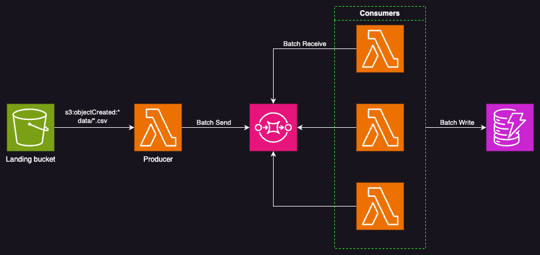

# POC: Batch Processing with Rust Lambda

## Overview

A simple POC to showcase batch processing of CSV data using AWS services, with a focus on Rust-based Lambda functions. The pipeline reads a CSV from S3, sends each line to SQS, processes messages in batches, and writes to DynamoDB (with DynamoDB only serving as an example batch destination, swap with your service of choice).

The purpose is to demonstrate how to handle batch processing (somewhat) efficiently using Rust-based AWS Lambda functions, leveraging SQS to manage (somewhat) large-scale event driven data ingestion and processing.

## Flow

A CSV file is uploaded to S3, which triggers a Lambda function. The Lambda reads the file line by line (asynchronously) and sends each entry to SQS.

SQS batches the messages and invokes a consumer Lambda, which processes the batch and performs a batch write to DynamoDB. The [ReportBatchItemFailures](https://docs.aws.amazon.com/lambda/latest/dg/services-ddb-batchfailurereporting.html) (partial batch response) mechanism ensures that only failed items are retried instead of the entire batch.

## Architecture

